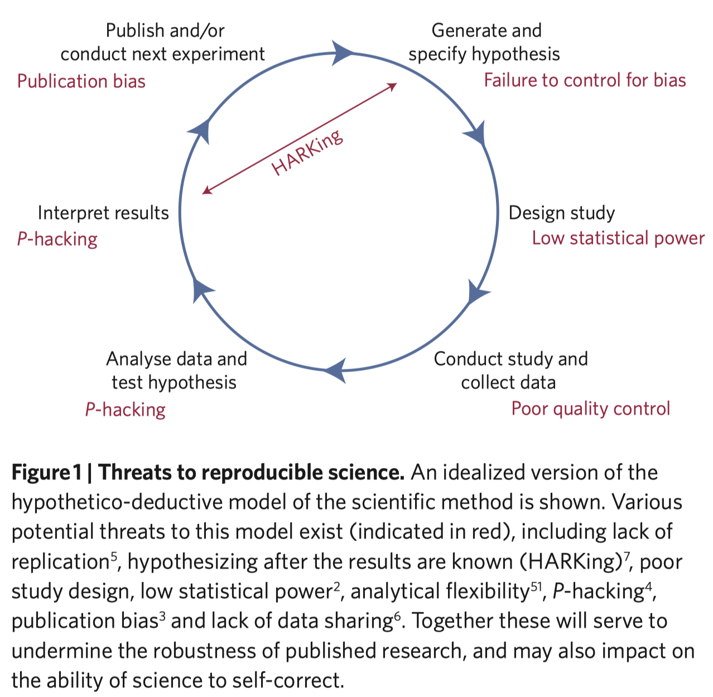
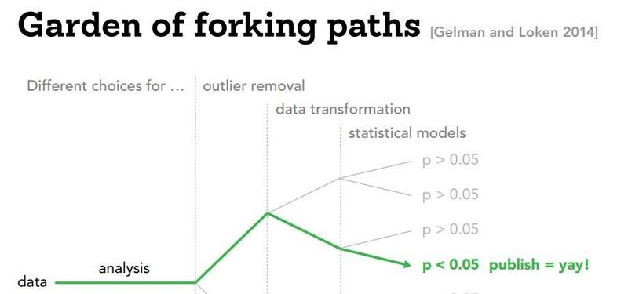
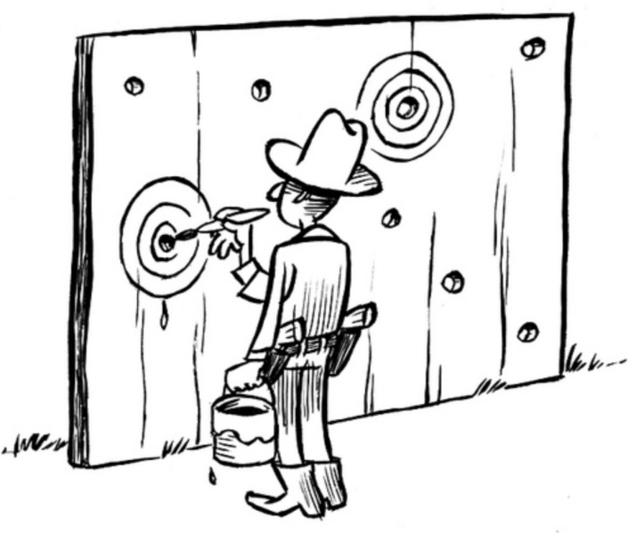
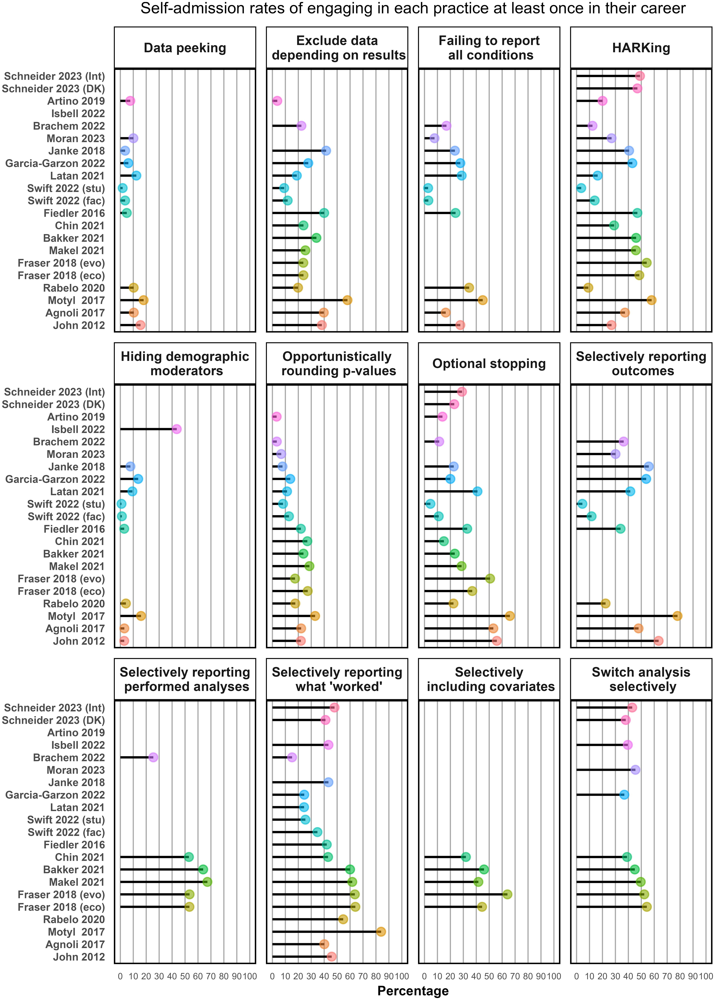
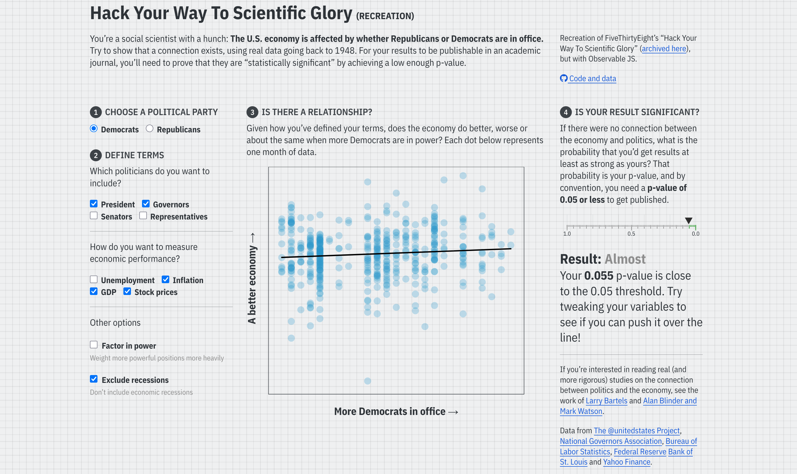
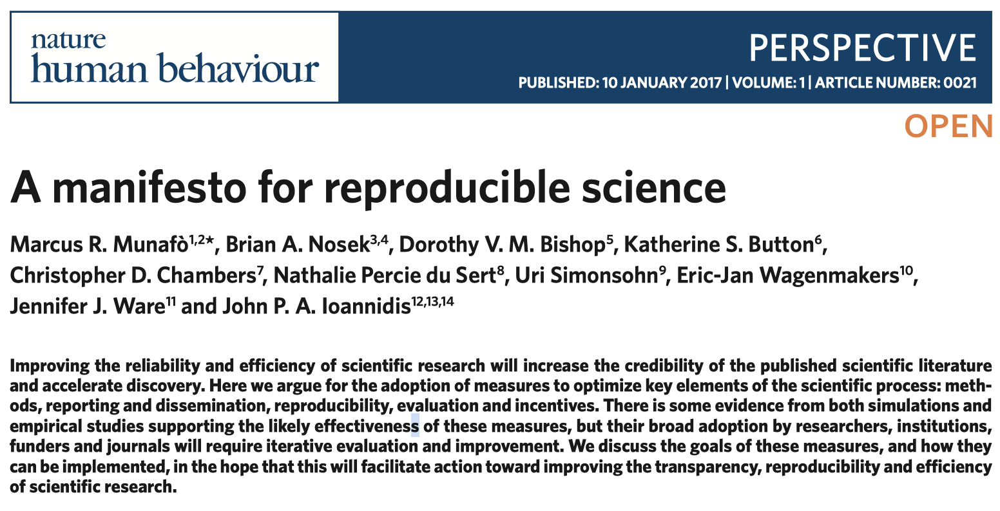
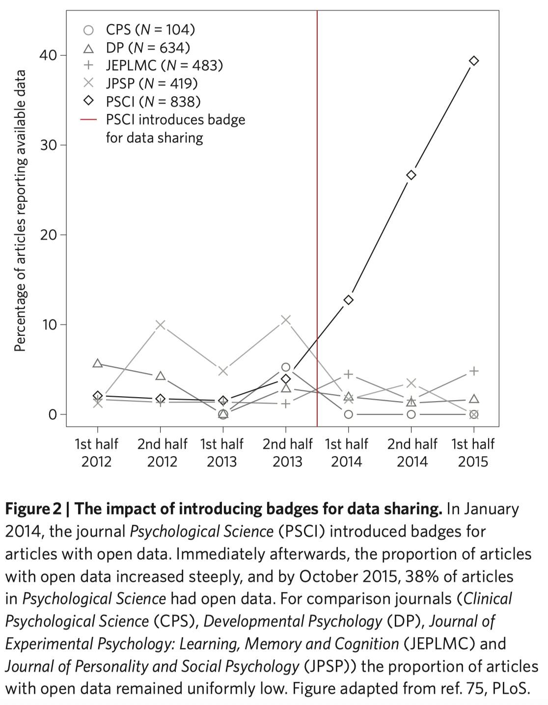
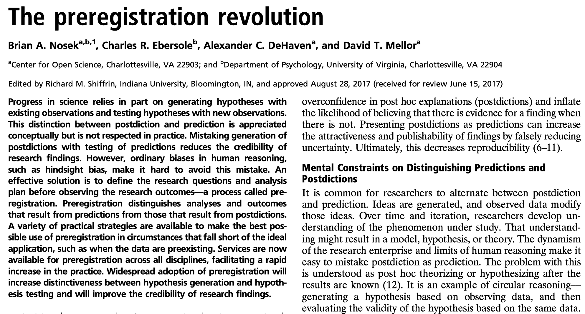
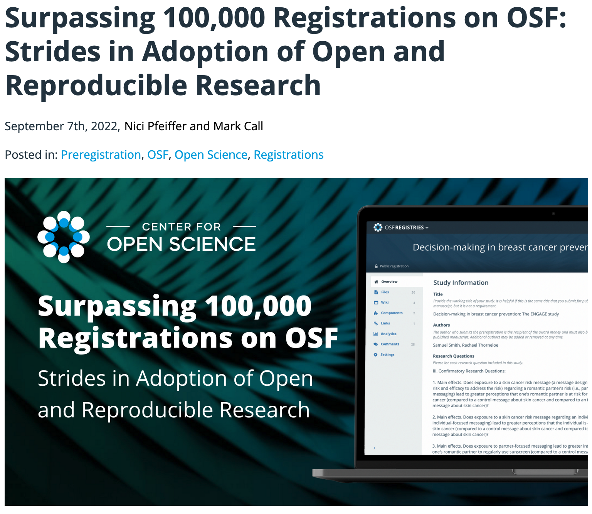

```{css, echo=FALSE} 
@media print { # print out incremental slides; see https://stackoverflow.com/questions/56373198/get-xaringan-incremental-animations-to-print-to-pdf/56374619#56374619
  .has-continuation {
    display: block !important;
  }
}
```

```{r setup, include=FALSE}
# figures formatting setup
options(htmltools.dir.version = FALSE)
library(knitr)
opts_chunk$set(
  comment = "  ",
  prompt = T,
  fig.align="center", #fig.width=6, fig.height=4.5, 
  # out.width="748px", #out.length="520.75px",
  dpi=300, #fig.path='Figs/',
  cache=F, #echo=F, warning=F, message=F
  engine.opts = list(bash = "-l")
  )

## Next hook based on this SO answer: https://stackoverflow.com/a/39025054
knit_hooks$set(
  prompt = function(before, options, envir) {
    options(
      prompt = if (options$engine %in% c('sh','bash')) '$ ' else 'R> ',
      continue = if (options$engine %in% c('sh','bash')) '$ ' else '+ '
      )
})

library(tidyverse)
library(kableExtra)
```


# Table of contents

<br>

1. [The replication crisis](#crisis)

2. [Reproducible science](#reproducible)

3. [Towards more trustworthy data science](#trustworthy)

<!-- ########################################### -->
---
class: inverse, center, middle
name: crisis

# The replication crisis
<html><div style='float:left'></div><hr color='#EB811B' size=1px style="width:1000px; margin:auto;"/></html>


---
# The replication crisis

.pull-left-wide2[
## What the crisis is about
- The fact that many scientific findings are difficult or impossible to reproduce.
- Reproducibility is a cornerstone of science as an enterprise of knowledge generation. This is bad.

## Factors fueling the replication crisis
- Wrong incentives in science leading to questionable research practices (see next slides)
- Limited data sharing and transparency
- Insufficient methodological training
]

.pull-right-small2[
<div align="center">
<br>

</div>
`Source` [Ioannidis 2005/PLOS Medicine](10.1371/journal.pmed.0020124)
]


---
# The replication crisis

.pull-left-wide2[
## What the crisis is about
- The fact that many scientific findings are difficult or impossible to reproduce.
- Reproducibility is a cornerstone of science as an enterprise of knowledge generation. This is bad.

## Factors fueling the replication crisis
- Wrong incentives in science leading to questionable research practices (see next slides)
- Limited data sharing and transparency
- Insufficient methodological training
]

.pull-right-small2[
<div align="center">
<br>

</div>
`Source` [Munafò et al., NHB](https://www.nature.com/articles/s41562-016-0021)
]


---
# Questionable practices fueling the crisis

.pull-left[
## Harmful behaviors

- **FORKing paths (Researcher Degrees of Freedom)**: Many plausible analytical choices; selecting those that yield desirable results. (Gelman/Loken 2013)
]

.pull-right-center[
<div align="center">

</div>

`Source` [Matthew Kay](https://www.si.umich.edu/about-umsi/news/ditch-stale-pdf-making-research-papers-interactive-and-more-transparent)
]


---
# Questionable practices fueling the crisis

.pull-left[
## Harmful behaviors

- **FORKing paths (Researcher Degrees of Freedom)**: Many plausible analytical choices; selecting those that yield desirable results.
- **HARKing (Hypothesizing After the Results are Known)**: Creating or revising hypotheses *after* seeing the data.
]

.pull-right-center[
<div align="center">

</div>

`Source` [Dirk-Jan Hoek](https://www.researchgate.net/figure/HARKing-Hypothesising-After-the-Results-are-Known-is-an-instance-of-the-Texas_fig1_343145874)
]


---
# Questionable practices fueling the crisis

.pull-left[
## Harmful behaviors

- **FORKing paths (Researcher Degrees of Freedom)**: Many plausible analytical choices; selecting those that yield desirable results.
- **HARKing (Hypothesizing After the Results are Known)**: Creating or revising hypotheses *after* seeing the data.
- **p-hacking**: Trying multiple analyses, subsamples, or model specifications until p < .05 appears.
]

.pull-right-center[
<div align="center">


</div>

`Source` [XKCD, Randall Munroe](https://xkcd.com/882/)
]


---
# Questionable practices fueling the crisis

.pull-left[
## Harmful behaviors

- **FORKing paths (Researcher Degrees of Freedom)**: Many plausible analytical choices; selecting those that yield desirable results.
- **HARKing (Hypothesizing After the Results are Known)**: Creating or revising hypotheses *after* seeing the data.
- **p-hacking**: Trying multiple analyses, subsamples, or model specifications until p < .05 appears.
- **Selective reporting**: Publishing only significant or theoretically convenient outcomes while omitting null or contradictory results.
]

.pull-right[
<div align="center">

</div>

`Source` [Krawczyk, M., PLOS One](https://journals.plos.org/plosone/article?id=10.1371/journal.pone.0127872)

<div style="font-size: 65%; line-height: 1.3; margin-top: 0; margin-bottom: 0;">
<i>"[i]t appears that some authors choose the mode of reporting their results in an arbitrary way. Moreover, they often end up doing it in such a way that makes their findings seem more statistically significant than they really are (which is well known to improve the chances for publication). Specifically, they frequently report p values “just above” significance thresholds directly, whereas other values are reported by means of inequalities (e.g. “p&lt;.1”), they round the p values down more eagerly than up and appear to choose between the significance thresholds and between one- and two-sided tests only after seeing the data. Further, about 9.2% of reported p values are inconsistent with their underlying statistics (e.g. F or t) and it appears that there are “too many” “just significant” values."</i>
</div>
]


---
# Questionable practices fueling the crisis

.pull-left[
## Harmful behaviors

- **FORKing paths (Researcher Degrees of Freedom)**: Many plausible analytical choices; selecting those that yield desirable results.
- **HARKing (Hypothesizing After the Results are Known)**: Creating or revising hypotheses *after* seeing the data.
- **p-hacking**: Trying multiple analyses, subsamples, or model specifications until p < .05 appears.
- **Selective reporting**: Publishing only significant or theoretically convenient outcomes while omitting null or contradictory results.

<br>

`Source` [Lakens et al., Evidence-based Toxicology](https://doi.org/10.1080/2833373X.2024.2376046)

]

.pull-right-center[
<div align="center">

</div>
]


---
# Hacking your way to scientific glory

<div align="center">

</div>

`Source` [Andrew Heiss (originally 538)](https://stats.andrewheiss.com/hack-your-way/)


<!-- ########################################### -->
---
class: inverse, center, middle
name: reproducible

# Reproducible science
<html><div style='float:left'></div><hr color='#EB811B' size=1px style="width:1000px; margin:auto;"/></html>


---
# A framework for improving reproducibility

.pull-left[
## Targets for reform (Munafò et al. 2017)

- **Methods.** Better training, collaboration, protecting against cognitive biases
- **Reporting & dissemination.** Promoting pre-registration, improving quality of reporting
- **Reproducibility.** Share data, code, and materials whenever possible
- **Evaluation.** Diversify peer review, preprints, pre-and post-publication
- **Incentives.** Reward openness and reproducibility, not only positive findings
]

.pull-right-center[
<div align="center">



</div>
`Source` [Munafò et al., NHB](https://www.nature.com/articles/s41562-016-0021)
]


---
# Preregistration

.pull-left-wide[
## Basic idea

- You write down hypotheses and analysis plans in advance.
- You time-stamp and register them in a public or private registry.
- You commit to the primary analysis before seeing the results.
- You clearly separate confirmatory from exploratory work.

## Why it potentially helps

- It constrains analytic flexibility and p-hacking.
- It reduces HARKing by fixing hypotheses in advance.
- It clarifies what counts as a decisive test.
- It increases credibility for both positive and null findings.
- Kaplan et al. (right plot): <i>"17 of 30 studies (57%) published prior to 2000 showed a significant benefit of intervention on the primary outcome in comparison to only 2 among the 25 (8%) trials published after 2000."</i>

]

.pull-right-small[
<div align="center">

</div>
`Source` [Nosek et al., PNAS](https://www.pnas.org/doi/10.1073/pnas.1708274114)
<br>
<div align="center">

</div>
`Source` [Kaplan et al., PLOS One](https://journals.plos.org/plosone/article?id=10.1371/journal.pone.0132382)

]


---
# Preregistration developments

.pull-left[
## Developments (Nosek et al. 2018)

- Rapid growth of preregistered studies across disciplines.
- Emergence of standardized templates and registries.
- Registered reports integrate preregistration into peer review.
- Journals accept papers based on design, not results.

## Remaining challenges

- Bad preregistrations can be vague or incomplete.
- Not all projects are suitable for rigid preregistration.
- Distinguishing exploratory work remains important.
- Incentives for high-quality preregistration are still evolving.
]

.pull-right-center[
<br>
<div align="center">

</div>

`Source` [Pfeiffer/Call, COS](https://www.cos.io/blog/surpassing-100000-registrations-on-osf)
]


<!-- ########################################### -->
---
class: inverse, center, middle
name: trustworthy

# Towards more trustworthy data science
<html><div style='float:left'></div><hr color='#EB811B' size=1px style="width:1000px; margin:auto;"/></html>


---
# Trust in science

.pull-center[
<div align="center">
<br>


</div>
`Source` [Pew 2020](https://www.pewresearch.org/science/2020/09/29/science-and-scientists-held-in-high-esteem-across-global-publics/)
]


---
# Trust in science

.pull-center[
<div align="center">
<br>

</div>
`Source` [Cologna et al. 2024](https://osf.io/preprints/osf/6ay7s)
]


---
# Trust in data science

.pull-left[
<div align="center">
<br>


</div>
]

.pull-left[
<div align="center">
<br>


</div>
]

---
# Trust in data science?

.pull-left[
<div align="center">
<br><br><br>


</div>
]

.pull-left[
<div align="center">
<br><br><br>


</div>
]


---
# Fostering trust in science through open science

.pull-left[
## Communicating the entire workflow

- Any decision - from conceptualizing measures to formatting tables - is meaningful for your output.
  - Tiny mistakes can have massive technical consequences (→ debugging).
  - Various decisions can have ethical implications (→ next session).
  - For others to follow (and potentially invalidate) your analyses, all the details are important.
- What makes the scientific endeavor unique is that it has self-correcting mechanisms. 
- But in order for them to work effectively, you have to **be transparent about every step in your workflow**.
]

.pull-right-center[
<br><br><br>
<div align="center">

</div>
]


---
# Fostering trust in science through open science

.pull-left[
## Communicating the entire workflow

- Any decision - from conceptualizing measures to formatting tables - is meaningful for your output.
  - Tiny mistakes can have massive technical consequences (→ debugging).
  - Various decisions can have ethical implications (→ next session).
  - For others to follow (and potentially invalidate) your analyses, all the details are important.
- What makes the scientific endeavor unique is that it has self-correcting mechanisms. 
- But in order for them to work effectively, you have to **be transparent about every step in your workflow**.
- That's a meta meaning of communication: tell others, by publishing everything from input to code to output, what you've done.
]

.pull-right-center[
<br><br><br>
<div align="center">

</div>
]


---
# Towards open data science (cont.)

.pull-left[
## Good practice

- Pre-register designs `osf.io`, `aspredicted.org` 
- Do version control `GitHub`
- Publish all research outputs (and inputs if possible) `GitHub`, `plain-text formats`
- Disclose and document software pipeline `targets`, `make`
- Make analysis reproducible `renv`, `Docker`
- Make preprints accessible `arXiv`, `osf.io`
- Public in open access journals
]

.pull-right-center[
<br>
<div align="center">

</div>
]


---
# Towards open data science (cont.)

.pull-left[
## Good practice

- Pre-register designs `osf.io`, `aspredicted.org` 
- Do version control `GitHub`
- Publish all research outputs (and inputs if possible) `GitHub`, `plain-text formats`
- Disclose and document software pipeline `targets`, `make`
- Make analysis reproducible `renv`, `Docker`
- Make preprints accessible `arXiv`, `osf.io`
- Public in open access journals

**Notice something?** 

Over the course, you have been nudged towards become open science practitioners. You are welcome.
]

.pull-right-center[
<br>
<div align="center">

</div>
]


