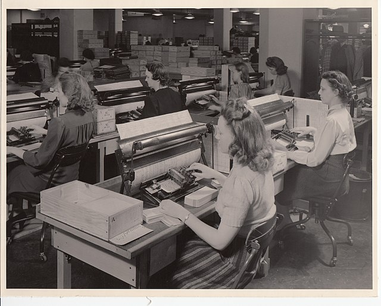

class: inverse, center, middle
name: hackathon

```{css, echo=FALSE} 
@media print { # print out incremental slides; see https://stackoverflow.com/questions/56373198/get-xaringan-incremental-animations-to-print-to-pdf/56374619#56374619
  .has-continuation {
    display: block !important;
  }
}
```

```{r setup, include=FALSE}
# figures formatting setup
options(htmltools.dir.version = FALSE)
library(knitr)
opts_chunk$set(
  prompt = T,
  fig.align="center", #fig.width=6, fig.height=4.5, 
  # out.width="748px", #out.length="520.75px",
  dpi=300, #fig.path='Figs/',
  cache=T, #echo=F, warning=F, message=F
  engine.opts = list(bash = "-l")
  )

## Next hook based on this SO answer: https://stackoverflow.com/a/39025054
knit_hooks$set(
  prompt = function(before, options, envir) {
    options(
      prompt = if (options$engine %in% c('sh','bash')) '$ ' else 'R> ',
      continue = if (options$engine %in% c('sh','bash')) '$ ' else '+ '
      )
})

library(tidyverse)
library(hrbrthemes)
library(fontawesome)
```


# The hackathon
<html><div style='float:left'></div><hr color='#EB811B' size=1px style="width:1000px; margin:auto;"/></html>


---
# Assignments and grading

| Component                           | Weight |
|:-|-:|
| 3(4) × homework assignments | pass/fail |
| 4(5) × online quizzes (5% each) | 20% |
| 1 × hackathon project       | 40% |
| 1 × in-class coding exam 	| 40% |

### Hackathon project
- On December 1, 14-16h, there will be a hackathon hosted at Hertie <b>in the Forum</b>.
- At the hackathon itself, I'll introduce the data and provide an environment that should facilitate you getting started with the project and finalize group formation.
- After the hackathon project, you will get instructions. You will then have <b>96 hours</b> to submit your solutions. <b>Submission deadline: December 5, 6pm CET</b>.
- The task is similar to the homework assignments but puts more emphasis on creative problem-solving using the tools and techniques you have learned in class.


---
# Hackathon project: guidance

.pull-left[
## 1. The tasks

The hackathon project will consist of two main tasks.

**The first** task is a set of specific problems to be solved with the data. There will be 4 sub-tasks, which might facilitate splitting up the tasks as a group. As a group of three you choose 3 out of 4 tasks to work on, as a group of 4 you work on all 4.

**The second** task is one that gives you more flexibility in what to do with the data. Within pre-specified constraints, you generate a "data insight" piece that focuses on a narrow question that can be answered with the data. The format is a brief, blog-style report for a non-technical audience that uses text and visuals to support your findings.
]

.pull-right[
<div align="center">
<br><br><br>

</div>
]


---
# Hackathon project: guidance

.pull-left[
## 2. Group formation

You submit your solution as a group, using the project GitHub repo (only one submission per group is expected). The statement of contributions clarifies who is part of the group and contributed to which component. 

If you couldn't find a group by the evening of December 1, please reach out to me. And don't feel embarrassed - sometimes things just don't work out. Also, think of those who cannot make it to the hackathon. Make use of the Moodle forum and other channels to reach out to them.
]

.pull-right[
<div align="center">
<br><br><br>

</div>
]


---
# Hackathon project: guidance

.pull-left[
## 3. The hackathon event and instructions

At the event, I'm going to introduce the data that you're going to use for the hackathon project. Also, you'll have the chance to interact with the data and develop ideas about possible research questions for the data insight piece.

The instructions will go online on the evening after the event. First thing to do is access the repo, then read the instructions. 

We will use GitHub classroom again for this. There will be two GitHub Classroom repos: One for individual use and one for groups. To collaborate on and ultimately submit your project, use the group repository (just as usual - commit + push). **Set up your group repository until December 2, 10am** - this serves as group registration for the project.
]

.pull-right[
<div align="center">
<br><br><br>

</div>
]

---
# Hackathon project: guidance

.pull-left[
## 4. Preparation

While I don't expect you to prepare for the event in particular, there are a couple of things that you still might want to do:

<ol type="a">
  <li>Check out the course materials again. By now, you should be proficient in the core tools of the tidyverse.</li>
  <li>Prepare a workflow for your group, and assign roles/responsibilities.</li>
  <li>Draft an Rmd template. You'll need two - one for the problem set, one for the blog article.</li>
</ol>
]

.pull-right[
<div align="center">
<br><br><br>

</div>
]


---
class: inverse, center, middle
name: exam

# The coding exam
<html><div style='float:left'></div><hr color='#EB811B' size=1px style="width:1000px; margin:auto;"/></html>


---
# Assignments and grading

| Component                           | Weight |
|:-|-:|
| 3(4) × homework assignments | pass/fail |
| 4(5) × online quizzes (5% each) | 20% |
| 1 × hackathon project       | 40% |
| 1 × in-class coding exam 	| 40% |

### In-class coding exam
- The in-class coding exam will take place on **December 12, 10-12h, in the Forum**.
- The exam will be open-book, open-internet, and open-R. Collaboration will not be allowed.
- The exam will be similar to the homework assignments but with a stronger emphasis on problem-solving under time constraints.
- You will have 90 minutes to solve the exam.


---
# The exam: what to expect

.pull-left[
## Structure

- The exam will consist of 10-15 tasks that you need to solve in R.
- The tasks will cover topics and techniques that we have covered in the course.
- You'll be working with 1-2 datasets that I will provide.
- The tasks will be non-cumulative, i.e., you can solve each task independently of the others. There might be a few sub-tasks that build on each other.
]

.pull-right[
<div align="center">
<br>

</div>
]

---
# The exam: what to expect


.pull-left[
## Potential topics

- Data wrangling: filtering, selecting, mutating, summarizing, joining, ...
- Writing functions
- Iteration
- Regular expressions
- Scraping HTMLs
- Modeling (only lm) and evaluation
- Data visualization: creating plots with ggplot2
]

.pull-right[
<div align="center">
<br>

</div>
]

---
# The exam: what to expect

.pull-left[
## Example question types

*Coding tasks to solve a specific problem with given data*

> Using the `penguins` data, create a new data frame that:
- excludes rows with missing values in any of `species`, `island`, `bill_length_mm`, `bill_depth_mm`, `flipper_length_mm`, or `body_mass_g`;
- contains only the variables listed above plus `sex` and `year`.

> Summarize the new data frame by `species` and `sex`, calculating the mean and standard deviation of `bill_length_mm` and `body_mass_g` for each group.
]

.pull-right[
<div align="center">
<br>

</div>
]

---
# The exam: what to expect

.pull-left[
## Example question types

*Code revision tasks to adjust given code*

> The following code is intended to create a scatter plot of `mpg` vs. `wt` from the `mtcars` dataset, colored by `cyl`. However, it contains several errors. Identify and correct the errors to produce the desired plot.
]

.pull-right[
<div align="center">
<br>

</div>
]


---
# The exam: what to expect

.pull-left[
## Example question types

*Tasks that ask you to write code freely*

> Write a function `summarise_species()` that:
- takes a character string `sp` as an input (the name of a species),
- filters `penguins` to this species (removing rows with missing body mass),
- returns a one-row tibble with the species name, the number of observations, the mean body mass, and the standard deviation of body mass.

> Do not print anything inside the function; just return the tibble.
]

.pull-right[
<div align="center">
<br>

</div>
]


---
# The exam: what to expect

.pull-left[
## Example question types

*Reflection and explanation tasks*

> Below you see R code that was used to generate the figure `penguins-scatter.png` that you find in the folder.
- Identify and explain any three issues with the plot regarding principles of good data visualization.
- Explain line by line what the code does.
- Suggest a modification to the code that would address one of the issues you identified.
]

.pull-right[
<div align="center">
<br>

</div>
]


